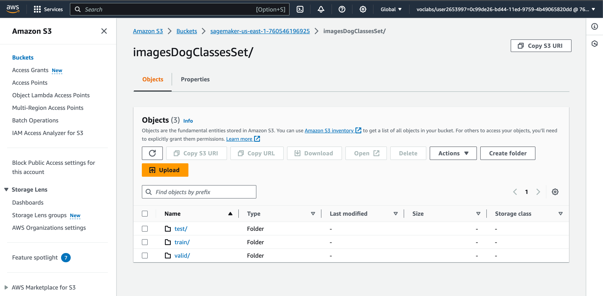
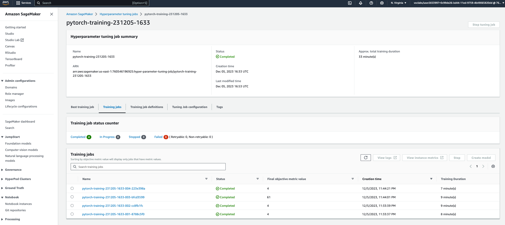
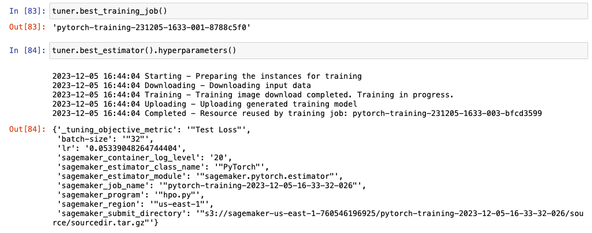
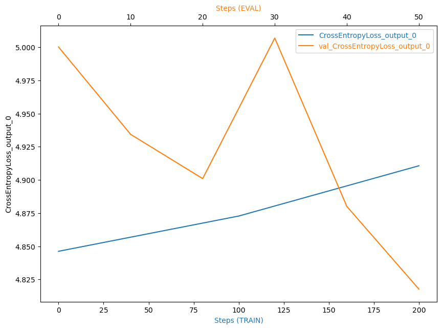

# Image Classification using AWS SageMaker

Use AWS Sagemaker to train a pretrained model that can perform image classification by using the Sagemaker profiling, debugger, hyperparameter tuning and other good ML engineering practices. This can be done on either the provided dog breed classication data set or one of your choice.

## Project Set Up and Installation
Enter AWS through the gateway in the course and open SageMaker Studio. 
Download the starter files.
Download/Make the dataset available. 

## Dataset
The provided dataset is the dogbreed classification dataset which can be found in the classroom.
The project is designed to be dataset independent so if there is a dataset that is more interesting or relevant to your work, you are welcome to use it to complete the project.

### Access
Upload the data to an S3 bucket through the AWS Gateway so that SageMaker has access to the data. 


## Hyperparameter Tuning
- Pretrained model: ResNet50, fine-tuned for image classification task
- Tuned hyperparameters: batch size and learning rate.
```
hyperparameter_ranges = {
    "batch-size": sagemaker.tuner.CategoricalParameter([32, 64, 128, 256, 512]),
    "lr": sagemaker.tuner.ContinuousParameter(0.001, 0.1),
}
``` 


Best hyperparameters after tuning:
```
'batch-size': '"32"',
'lr': '0.05339048264744404',
```

## Debugging and Profiling
The model debugging and profiling is performed by using SageMaker Debugger via the following steps:
**Step 1**: Import SageMaker Debugger client librariy, `SMDebug`, in the `train_model.py`
**Step 2**: Add the `SMDebug` hooks for PyTorch in the `train()` and `test()` functions. The model hyperparamters are set with the optimal values found by the previous step:
```
'batch-size': '"32"',
'lr': '0.05339048264744404',
``` 
**Step 3**: Create hook and register to the model in the `main()` function
More details can be found in the `train_model.py` 

### Results

As can be seen in the training debugging figure as above, the validation loss has started decreasing, while the training loss still increases. This anomaly occurs because the number of training epochs is small, so that the training process cannot be converged yet.
However, due to the limited resource of AWS services can be used in this course, I cannot let the training process run longer with more epochs.

The full profiler report can be found in [profiler-report.html](ProfilerReport/profiler-output/profiler-report.html). Please refer the `ProfilerReport` directory for further infomation.

## Model Deployment
The trained model in the previous section is deployed on SageMaker as below
```
from sagemaker.pytorch import PyTorchModel

estimator = PyTorchModel(
    model_data=model_location,
    role=role,
    entry_point="infer.py",
    py_version="py36",
    framework_version="1.8",
    predictor_cls=ImgPredictor
)

predictor = estimator.deploy(initial_instance_count=1, instance_type="ml.m5.large")
```


How to query the endpoint with a sample input
```
from PIL import Image
import io
import numpy as np

path = "/home/ec2-user/SageMaker/CD0387-deep-learning-topics-within-computer-vision-nlp-project-starter/dogImages/test/004.Akita/Akita_00244.jpg"

with open(path, "rb") as f:
    image = f.read()
    display(Image.open(io.BytesIO(image)))
    
    response = predictor.predict(image, initial_args={"ContentType": "image/jpeg"}) 
    prediction = np.argmax(response, 1) + 1
    print("Expected class: 4 (Akia)")
    print(f"Predicted class: {prediction}")
```